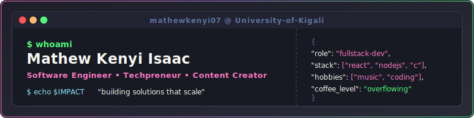
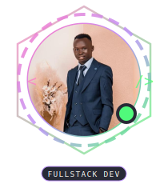
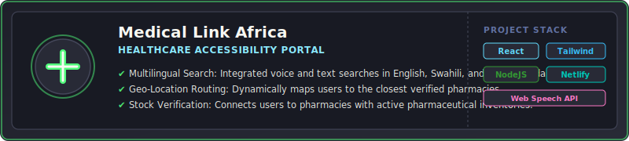
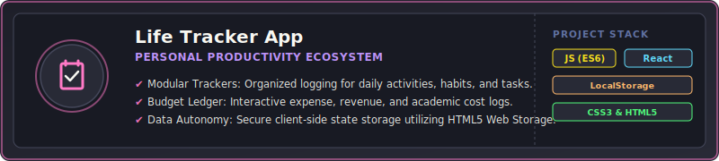

  

 

  
  <b>Mathew Kenyi Isaac</b> 
  <em>Software Engineer &amp; Techpreneur</em>  
  🎓 BSc Computer Science — <strong>University of Kigali</strong> 
  💻 Full-Stack Developer &amp; Technical Content Creator 
  🌍 Building software solutions that solve real community challenges

  
  
  
  &nbsp;&nbsp;
  

 

---

## ⚡ About Me

I am a software engineer and student dedicated to translating complex ideas into elegant, user-centric code. I focus on developing full-stack applications with an emphasis on performance, accessibility, and community impact. 

* 🔭 **Current Focus**: Scaling mobile & web-based community tools.
* 🎓 **Academics**: Deepening my understanding of algorithms, database systems, and software engineering principles at the **University of Kigali**.
* 💡 **Philosophy**: Write clean code, automate the boring stuff, and build with purpose.
* 🎵 **Dev Fuel**: High-tempo music and strong coffee.

 

## 🛠️ Tech Stack & Skills

### 💻 Languages &amp; Core

  &nbsp;
  &nbsp;
  &nbsp;
  &nbsp;
  

### 🚀 Frameworks &amp; Libraries

  &nbsp;
  &nbsp;
  &nbsp;
  

### 🗄️ Databases, Services &amp; Tools

  &nbsp;
  &nbsp;
  &nbsp;
  &nbsp;
  

 

## 📁 Featured Projects

<!-- Project 1: Medical Link Africa -->

  

  
  &nbsp;&nbsp;&nbsp;&nbsp;
  

  

  

<!-- Project 2: Life Tracker App -->

  

  
  &nbsp;&nbsp;&nbsp;&nbsp;
  

  

 

## 📊 GitHub Metrics & Activity

<!-- 
  GUIDE FOR DYNAMIC WIDGETS:
  1. GitHub Stats & Top Languages now use the 'github-stats-extended' mirror because the official vercel app is suspended/paused.
  2. The Contribution Snake animation is generated by the GitHub Actions workflow (.github/workflows/snake.yml).
  3. The snake will show as a broken image until you push this repository to GitHub and run the Action for the first time.
  4. IMPORTANT: Make sure your repository name is exactly 'mathewkenyi07' on GitHub, and then run the action manually under the 'Actions' tab.
-->

  
  &nbsp;&nbsp;
  

 

  
    
  

 

### 👾 Contribution History

  
<strong>Click to see my contribution snake eat commits 🐍</strong>

   
  <picture>
    <source media="(prefers-color-scheme: dark)" srcset="https://raw.githubusercontent.com/mathewkenyi07/Mathewkenyi07/output/github-snake-dark.svg">
    <source media="(prefers-color-scheme: light)" srcset="https://raw.githubusercontent.com/mathewkenyi07/Mathewkenyi07/output/github-snake.svg">
    
  </picture>

 

---

  

